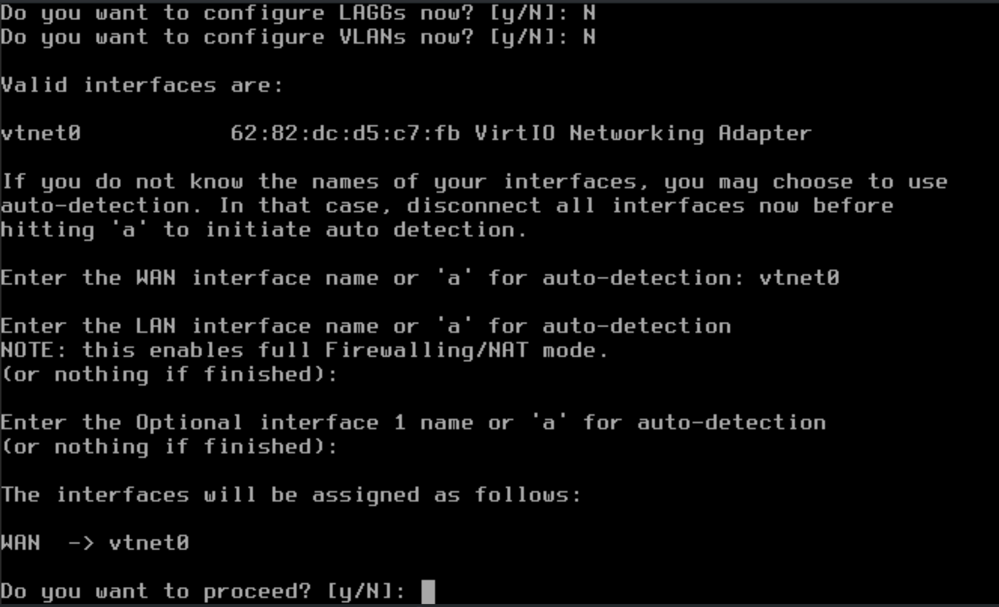

# Proxmox and OPNsense with Netcup Root Server

(Nested virtualization)

- [Proxmox and OPNsense with Netcup Root Server](#proxmox-and-opnsense-with-netcup-root-server)
  - [Install Debian 11 Netinstall](#install-debian-11-netinstall)
  - [Post Install Debian 11](#post-install-debian-11)
  - [Proxmox VE install](#proxmox-ve-install)
    - [Change to root](#change-to-root)
    - [Edit /etc/hosts](#edit-etchosts)
    - [Add Proxmox Repository](#add-proxmox-repository)
    - [Add Proxmox Key (as root or sudo)](#add-proxmox-key-as-root-or-sudo)
    - [Begin installation](#begin-installation)
    - [Install pve-kernel-5.4.203-1](#install-pve-kernel-54203-1)
    - [Post Proxmox Install ToDo's](#post-proxmox-install-todos)
      - [Create Interface](#create-interface)
      - [Certificates for Proxmox](#certificates-for-proxmox)
  - [Preparations for OPNsense VM installation under Proxmox](#preparations-for-opnsense-vm-installation-under-proxmox)
  - [Install OPNSense VM](#install-opnsense-vm)
    - [Assign interfaces](#assign-interfaces)
    - [Set interface IP address](#set-interface-ip-address)


Instructions for the installation of Proxmox and OPNsense on a root server of Netcup in Karlsruhe, Germany.

<https://netcup.de>

I use a RS 8000 for this Howto. The server has 14 cores and 64 GB Ram as well as 2 TB SSD storage.

However, these instructions should also work on any other server with nested virtualization.

No advertising the server was not provided to me for free, I do this just for fun.

## Install Debian 11 Netinstall

- English / German Keymap
- Servername proxmox.yourdomain.tld
- root use a strong password
- user yourusername use a strong password
- LVM Setup full space / one partition
- only SSH Server and standard system utilities
- grub on sda

## Post Install Debian 11

Attention: NO CHANGES on Network Interfaces!!!!

edit .ssh/config

```bash
Host [CONFIG NAME] 
    Hostname [SERVER_IP] 
    User [USERNAME]
    Port 22
    IdentityFile ~/.ssh/[SSH_KEY]
```

add key for ssh

```bash
    ssh-copy-id -i .ssh/SSH_KEY.pub [USERNAME]@[SERVER_IP]
```

Install Packages

```bash
su #Password for root user
apt update && apt upgrade -y
apt install sudo mc htop bridge-utils net-tools ifupdown2 -y
/sbin/usermod -aG sudo [USERNAME]
```

Reboot

```bash
systemctl reboot
```

## Proxmox VE install

<https://pve.proxmox.com/wiki/Install_Proxmox_VE_on_Debian_11_Bullseye>

### Change to root

```bash
sudo -i
```

### Edit /etc/hosts

remove 127.0.1.1 and [SERVER_IP] like this

  127.0.0.1       localhost
  192.168.15.77   prox4m1.proxmox.com prox4m1

### Add Proxmox Repository

```bash
echo "deb [arch=amd64] <http://download.proxmox.com/debian/pve> bullseye pve-no-subscription" > /etc/apt/sources.list.d/pve-install-repo.list
```

### Add Proxmox Key (as root or sudo)

```bash
wget <https://enterprise.proxmox.com/debian/proxmox-release-bullseye.gpg> -O /etc/apt/trusted.gpg.d/proxmox-release-bullseye.gpg
```

### Begin installation

Update and Upgrade System

```bash
apt update && apt full-upgrade -y
```

First install pve-kernel-5.15 (this will be replaced later by the kernel pve-kernel-5.4.203)

```bash
apt install pve-kernel-5.15 -y
systemctl reboot
```

After reboot

```bash
uname -r
```

> 5.15.74-1-pve

Install Proxmox VE packages

```bash
apt install proxmox-ve postfix open-iscsi -y
```

Remove Debian Kernel

```bash
apt remove linux-image-amd64 'linux-image-5.10*'
```

Update and check grub2 config

```bash
root@proxmox:~# update-grub
```

### Install pve-kernel-5.4.203-1

Why I use a 5.4LTS kernel here?

I have tested many different kernels in this combination. And even though the 5.4.LTS kernel is no longer shipped with Debian Bullseye and is not recommended for Proxmox VE, I have had the best experience with it and can definitely guarantee that it works as of the date of writing this howto.

```bash
wget <http://download.proxmox.com/debian/pve/dists/buster/pve-no-subscription/binary-amd64/pve-kernel-5.4.203-1-pve_5.4.203-1_amd64.deb>
dpkg -i pve-kernel-5.4.203-1-pve_5.4.203-1_amd64.deb
```

Add pve-kernel-5.4.203 as default

```bash
pve-efiboot-tool kernel list
```

Ausgabe:
>Manually selected kernels:
>None.
>
>Automatically selected kernels:
>5.15.74-1-pve
>5.4.203-1-pve

```bash
pve-efiboot-tool kernel pin 5.4.203-1-pve
```

Ausgabe:

>Setting '5.4.203-1-pve' as grub default entry and running update-grub.
>Generating grub configuration file ...
>Found linux image: /boot/vmlinuz-5.15.74-1-pve
>Found initrd image: /boot/initrd.img-5.15.74-1-pve
>Found linux image: /boot/vmlinuz-5.4.203-1-pve
>Found initrd image: /boot/initrd.img-5.4.203-1-pve
>Warning: os-prober will not be executed to detect other bootable partitions.
>Systems on them will not be added to the GRUB boot configuration.
>Check GRUB_DISABLE_OS_PROBER documentation entry.
>done

```bash
pve-efiboot-tool kernel list
```

Ausgabe:

>Manually selected kernels:
>None.
>
>Automatically selected kernels:
>5.15.74-1-pve
>5.4.203-1-pve
>
>Pinned kernel:
>5.4.203-1-pve

Add pve-no-subcription repository

attach to /etc/apt/sourclist.d/pve-no-subscription.list

```bash
# PVE pve-no-subscription repository provided by proxmox.com,
# NOT recommended for production use
deb <http://download.proxmox.com/debian/pve> bullseye pve-no-subscription
```

Update and Upgrade after Install and Reboot the System

```bash
apt update && apt upgrade -y
systemctl reboot
```

### Post Proxmox Install ToDo's

Call Proxmox Frontend in Browser

- <https://[SERVER_IP>]:8006

#### Create Interface

The interfaces can be created via the frontend or via the /etc/network/interfaces , personally I recommend to do this via the console (SSH access). For this example you need 2 IPv4 addresses.

```bash
source /etc/network/interfaces.d/*
auto lo
iface lo inet loopback

auto ens3
iface ens3 inet manual

auto vmbr0
iface vmbr0 inet static
    address [MAIN_IPv4]/22
    gateway [GATEWAY_IPv4]
    bridge-ports ens3
    bridge-stp off
    bridge-fd 1
    pointopoint [MAIN_IPv4]
    bridge_hello 2
    bridge_maxage 12
    bridge_maxwait 0
    post-up sysctl -w net.ipv4.ip_forward=1
    post-up ip route add [SECOND_IPv4]/32 dev vmbr0

auto vmbr1
iface vmbr1 inet static
    address 10.10.10.2/24
    bridge-ports none
    bridge-stp off
    bridge-fd 0
    pre-up ethtool -G eno1 rx 1024 tx 1024
    pre-up ethtool -K eno1 tx off gso off
    post-up ethtool -K vmbr1 tx off gso off
    post-up sysctl -w net.ipv4.ip_forward=1
    post-up iptables -t nat -A POSTROUTING -s '10.10.10.0/24' -o vmbr0 -j MASQUERADE
    post-down iptables -t nat -D POSTROUTING -s '10.10.10.0/24' -o vmbr0 -j MASQUERADE
```

This is only an example, moreover the IPv6 config is still missing here.


#### Certificates for Proxmox

Datacenter / ACME
(Bild: acme_add_account_proxmox)

- Accounts ADD
  - Account Name:   Example.com
  - E-Mail:         your.email@domain.com
  - ACME Directory: Let's Encrypt V2

- Register

Challenge Plugins ADD
(Bild: add_acme_dns_plugin)

DNS API choice: Example Cloudflare Managed DNS (Bild: acme_dns_cloudflare_plugin)

Fill all Fields with valid data.

=> Add

Proxmox / System / Certificates

- ACME / Add
  - Challenge Type: HTTP or DNS (wildcard ssl cert needs DNS Plugin)
  - Domain:         your Domain or Subdomain if you set Default Domain under

## Preparations for OPNsense VM installation under Proxmox

- upload opnsense iso
- Create VM
  - General: give your VM a name
  
  - OS: select yor ISO Image, in this case OPNsense ISO
  
  - System: for OPNsense you can check Qemu Agent
  
  - Disks: Add a Disk for your VM and check IO Thread
  
  - CPU: There are different opinions about how many CPUs and memory should be assigned to the OPNsense.
  
    - Decide for yourself afterwards you can always change it.
  - Memory: Same as CPU diffrent opinions.
  
  - Network: I have not added a network interface and will do so later.
  
  - Confirm: Overview of all specifications.
  

- Hardware / Add / Network Device
  - First we add only vmbr0 for WAN Interface
  

## Install OPNSense VM

- Select OPNSense VM and Console then click start now
- If you see this screen login with installer and opnsense
  
- Now install opnsense, choose your keyboard layout and the desired filesystem. If you have assigned multiple disks to your VM before, you can even use ZFS with mirror or raid function.
- as last point change your root passwort and then reboot opnsense.
  
- after reboot you login with root and you password
  
- after login you see this options
    

### Assign interfaces

- Do you want to configure LAGGs now? N
- Do you want to configure VLANs now? N
- Enter the WAN interface name or 'a' for auto-detection: vtnet0

At this point we do not want to configure a LAN interface. Therefore the next 2 points can be skipped with Enter.
  
- "Do you want to proceed?" We answer with Yes
  

### Set interface IP address

- Configure IPv4 address WAN interface via DHCP? N
- Enter the new WAN IPv4 address. Press ENTER for none:

> [SECOND_IPv4]

- Enter the new WAN IPv4 subnet bit count:

> 32 #I take 32 here because no other IP is needed in this WAN.

- For a WAN, enter the new WAN IPv4 upstream gateway address:

> [MAIN_IPv4]

  

- Questions about name server for WAN and IPv6 answer with N or Enter.

- Set the GUI to https
- Add self signed certificate
- Reset the gui values to default.

Now you can call your OPNsense GUI in your Browser.
> [Second_IPv4:443]

..


